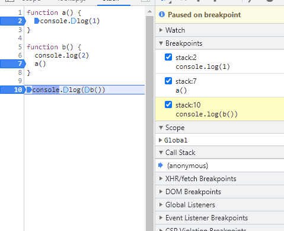
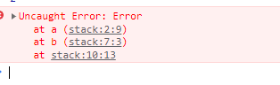

# 线程机制与事件循环


## 线程与进程

进程描述了 **CPU 在运行指令及加载和保存上下文所需的时间**，放在应用上来说就代表了一个程序。线程是进程中的更小单位，描述了执行一段指令所需的时间。

把这些概念拿到浏览器中来说，当你打开一个 Tab 页时，其实就是创建了一个进程，一个进程中可以有多个线程，比如渲染线程、JS 引擎线程、HTTP 请求线程等等。当你发起一个请求时，其实就是创建了一个线程，当请求结束后，该线程可能就会被销毁。

- 进程
  - 程序的一次执行，它占有一片独有的内存空间
  - 可以通过 `window` 任务管理器查看进程
- 线程
  - 是进程内的一个独立执行单元
  - 是程序执行的一个完整流程
  - 是CPU的最小的调度单元
- 关系
  - 一个进程至少有一个线程（主）
  - 程序是在某个进程中的某个线程执行的

## 执行栈

执行栈就是存储函数调用的**栈结构**，遵循先进后出的原则

```js
function a() {
  console.log(1)
}

function b() {
  console.log(2)
  a()
}

console.log(b())
```

看到上面的代码，在调试阶段可以看到执行栈的执行顺序。首先执行全局代码，根据先进后出的原则，后执行的函数 `a` 会先弹出栈。



或者在一些报错信息中，也可以找到执行栈的痕迹

```js
function a() {
  throw new Error('error')
}

function b() {
  console.log(2)
  a()
}

console.log(b())
```



我们可以在上图中看到报错在 `a` 函数，`a` 函数又是在 `b` 函数中调用的。

当我们使用递归的时候，因为执行栈的内存空间是有限的，一旦存放了过多的函数且没有得到释放的话，就会出现爆栈的问题。

## 浏览器内核模块

- 主线程
  - `js` 引擎模块：负责js程序的编译与运行
  - html,css文档解析模块：负责页面文本的解析
  - DOM/CSS模块：负责dom/css在内存中的相关处理
  - 布局和渲染模块：负责页面的布局和效果的绘制（内存中的对象）
- 分线程
  - 定时器模块：负责定时器的管理
  - DOM事件响应模块：负责事件的管理
  - 网络请求模块：负责Ajax请求

## js线程

- js是单线程执行的（回调函数在主线程）
- h5提出了实现多线程的方案：Web Workers
- 只能是主线程更新界面

## 定时器问题

- 定时器并不是完全定时
- 如果在主线程执行了一个长时间的操作，可能导致延时才处理

## 事件处理机制

- 代码分类
  - 初始化执行代码：包含绑定dom事件监听，设置定时器，发送 `ajax` 请求的代码
  - 回调执行代码：处理回调逻辑
- js引擎执行代码的基本流程
  - 初始话代码 ==> 回调代码
  - 先执行初始化代码：包含一些特别的代码回调函数（异步执行）
    - 设置定时器
    - 绑定事件监听
    - 发送 `ajax` 请求
  - 后面在某个时刻才会执行回调代码
- 模块的2个重要组成部分
  - 事件管理模块
  - 回调队列
- 模块的运转流程
  - 执行初始化代码，将事件回调函数交给对应的模块管理
  - 当事件发生时，管理模块会将回调函数及其数据添加到回调队列中
  - 只有当初始化代码执行完后（可能要一定时间），才会遍历读取回调队列中的回调函数执行

## Web Workers

```javascript
// 可以让js在分线程执行
// main.js
var worker = new Worker('worker.js')
worker.onMessage = function(event) {
  console.log(event.data) // 主线程接收分线程发送过来的数据
}
worker.postMessage(data) // 向分线程发送数据
// worker.js
var onmessage = function(event) {
  console.log(event.data) // 接口主线程发送数据
  // 向主线程发送数据
  postMessage(reslut)
}
```

> 缺点


- `worker` 内代码不能操作 `DOM` 更新视图
- 浏览器兼容问题
- 不能跨域加载 `Js`


