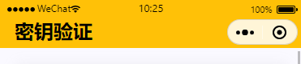

# uni-app 开发一些自定义组件

近期开发移动业务多一点，都是使用 `uni-app` 开发；开发中一些需要注意的地方和开发技巧记录下来，以便后续能有个地方查证。

## 自定义头部导航栏

自定义头部应该是最常见的一个需求，以前小程序都不能修改头部或者要么只能全局自定义，后来才逐渐放开可以单个页面自定义头部。

### 隐藏自带的导航栏

需要自定义头部，可以在项目根目录 `pages.json` 路由上设置 `navigationStyle: custom`。

```json
// pages.json
{
  "path": "pages/test/test",
  "style": {
   "navigationStyle": "custom"
  }
}
```

如果要全局隐藏

```json
"globalStyle": {
   "navigationStyle": "custom"
}
```

### 自定义导航

自定义头部需要计算导航栏高度

```html
<!--  page-head -->
<template>
  <view class="nav-box" :style="{height: navBarHeight + 'px'}">
    <view class="capsule-box" :style="{height: menuHeight + 'px', 'line-height': menuHeight + 'px', bottom: menuBottom + 'px'}">
      <view class="nav-title">
        <view v-if="!!title" class="nav">{{title}}</view>
      </view>
    </view>
  </view>
</template>
```

导航栏高度又由几个高度计算而来：`状态栏到胶囊的间距（胶囊上坐标位置-状态栏高度） * 2 + 胶囊高度 + 状态栏高度`。

状态栏的高度：[uni.getSystemInfoSync](https://uniapp.dcloud.net.cn/api/system/info.html)

```js
// 获取系统信息
const systemInfo = uni.getSystemInfoSync();
// 状态栏
systemInfo.statusBarHeight
```

而胶囊信息可以通过：[uni.getMenuButtonBoundingClientRect](https://uniapp.dcloud.net.cn/api/ui/menuButton.html#getmenubuttonboundingclientrect) 获取

```js
/**
 * 获取微信小程序菜单栏(胶囊)信息
 * 菜单按键宽度：width
 * 菜单按键高度：height
 * 菜单按键上边界坐标：top
 * 菜单按键右边界坐标：right
 * 菜单按键下边界坐标：bottom
 * 菜单按键左边界坐标：left
 */
menuButtonInfo = uni.getMenuButtonBoundingClientRect();
```

最后设置高度

```js
  props: {
  title: String
 },
  data() {
   return {
      navBarHeight: 0,
      menuBottom: 0,
      menuHeight: 0
   };
  },
  mounted() {
    this.$nextTick(() => {
      this.calcNavBarInfo();
    })
  },
  methods: {
    // 计算导航栏高度
    calcNavBarInfo() {
      // 获取系统信息
      const systemInfo = uni.getSystemInfoSync();
      const menuButtonInfo = this.getMenuButtonInfo(systemInfo);
      // 胶囊按钮位置信息
      // 导航栏高度 = 状态栏到胶囊的间距（胶囊上坐标位置-状态栏高度） * 2 + 胶囊高度 + 状态栏高度
      const navBarHeight = (menuButtonInfo.top - systemInfo.statusBarHeight) * 2 + menuButtonInfo.height + systemInfo.statusBarHeight;
      // 状态栏和菜单按钮(标题栏)之间的间距
      // 等同于菜单按钮(标题栏)到正文之间的间距（胶囊上坐标位置-状态栏高度）
      const menuBottom = menuButtonInfo.top - systemInfo.statusBarHeight;
      // 菜单按钮栏(标题栏)的高度
      const menuHeight = menuButtonInfo.height;
      this.navBarHeight = navBarHeight;
      this.menuBottom = menuBottom;
      this.menuHeight = menuHeight;
      this.$emit('getnavinfo', {
        navBarHeight,
        menuBottom,
        menuHeight,
        systemInfo
      });
    },
    // 判断是否为 IOS
    checkSystem(res) {
      const { system } = res;
      const _sys = system.toLocaleUpperCase();
      return _sys.includes('IOS');
    },
    getMenuButtonInfo(systemInfo) {
      // fix: IOS 获取胶囊信息存在0值情况，由于 IOS 胶囊信息固定所以直接固定值
      let menuButtonInfo = {
        width: 87,
        height: 32,
        left: systemInfo.screenWidth - 7 - 87,
        right: systemInfo.screenWidth - 7,
        top: systemInfo.statusBarHeight + 4,
        bottom: systemInfo.statusBarHeight + 4 + 32
      };
      const isIOS = this.checkSystem(systemInfo);
      if (isIOS) {
        // ios设备的胶囊按钮都是固定的
        return menuButtonInfo;
      } else {
        menuButtonInfo = uni.getMenuButtonBoundingClientRect();
      }
      return menuButtonInfo;
    }
  } 
```

实现效果：



## 自定义内容区

当自定义头部导航栏后，如果页面存在滚动条时，会出现滚动条在导航栏上；对于 `UI` 是不能忍的，没办法随叫 `UI` 是个妹子呢😉

其实也简单，只要使用 `scroll-view` 组件包裹内容区就行，麻烦点的是需要设置 `scroll-view` 的高度。而它的高度其实就是

```js
可视区域高度 - 导航栏高度
```

- 定义组件 page-layout

```html
<template>
 <view class="page-layout">
  <page-head class="nav-ref" v-if="!!title" :title="title" @getnavinfo="getNavInfo"></page-head>
  <scroll-view class="page-container" enable-back-to-top scroll-y
   :style="{'padding-top': !!title ? containerStyle: '0', 'height': containerHeight}">
   <slot></slot>
  </scroll-view>
 </view>
</template>
```

需要在 `page-head` 组件中发送出导航栏高度信息

```js
calcNavBarInfo() {
  // ...
  this.$emit('getnavinfo', {
    navBarHeight,
    menuBottom,
    menuHeight,
    systemInfo
  });
}

```

计算当前内容高度

```js
const getNavInfo = (options: any) => {
  const {
    navBarHeight,
    systemInfo
  } = options;
  containerStyle.value = (navBarHeight) + 'px'
  containerHeight.value = (systemInfo.screenHeight - navBarHeight) + 'px'
}

```


## 自定义底部导航

底部导航也是 `UI` 妹子最喜欢弄得花里胡巧一个地方

## 全局组件

## Vue2 和 Vue3 的一些区别
